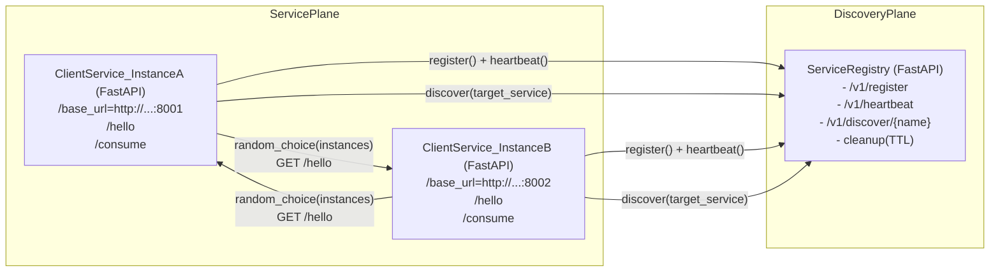

# Microservice Discovery (FastAPI) — Architecture

This project implements a minimal but production-shaped **service discovery** pattern:

- A **central registry** (`service_registry.py`) stores live service instances.
- Each **service instance** (`client_service.py`) registers on startup, sends **heartbeats**, and deregisters on shutdown.
- A **client endpoint** (`/consume`) performs **service discovery** and then calls a **random instance** of the discovered service.

The implementation is intentionally in-memory and lightweight (no database, no auth) because the goal is learning the core ideas.

## Key requirements mapping

- **Run 2 service instances**: run two `client_service.py` processes (different ports) or deploy `replicas: 2` in Kubernetes.
- **Register services**: each instance calls `POST /v1/register` on startup.
- **Discovery**: client calls `GET /v1/discover/{service_name}` to fetch live instances.
- **Random routing**: `/consume` chooses a random instance from the discovery pool and calls its `/hello`.
- **Health + cleanup**: instances heartbeat `POST /v1/heartbeat`; registry deletes stale instances via an asyncio cleanup loop.

## Architecture diagram (Mermaid)



## Data model (registry)

The registry stores instances under a service name:

- **Key**: `service_name`
- **Instance key**: `instance_id` (stable per instance; env-provided or UUID)
- **Fields**:
  - `base_url`: where the instance can be reached (e.g., `http://10.1.2.3:8000`)
  - `last_heartbeat_at_epoch_s`: liveness signal timestamp
  - `ttl_seconds`: if no heartbeat is received for `ttl_seconds`, the instance is stale
  - `metadata`: free-form debug info (pid, hostname, etc.)

## Endpoints

### Registry (`service_registry.py`)

- **POST** `/v1/register`
  - Upserts an instance and sets `last_heartbeat_at` to “now”.
- **POST** `/v1/heartbeat`
  - Updates `last_heartbeat_at` for a registered instance.
- **POST** `/v1/deregister`
  - Removes an instance (best effort; used for graceful shutdown).
- **GET** `/v1/discover/{service_name}`
  - Returns only instances that are currently live (TTL check).
- **GET** `/v1/services`
  - Debug view of everything currently registered.
- **GET** `/healthz`
  - Basic health endpoint.

### Client service (`client_service.py`)

- **GET** `/hello`
  - A target endpoint to prove discovery + routing works.
- **GET** `/consume`
  - Calls the registry to discover instances of `target_service`, then chooses one at random and calls its `/hello`.
- **GET** `/healthz`
  - Basic health endpoint.

## Running locally (2 instances)

Install deps:

```bash
python -m venv .venv
source .venv/bin/activate
pip install -r requirements.txt
```

Terminal A (registry on 8000):

```bash
uvicorn service_registry:app --host 0.0.0.0 --port 8000
```

Terminal B (service instance A on 8001):

```bash
REGISTRY_URL="http://localhost:8000" SERVICE_NAME="demo-service" SERVICE_PORT=8001 \
PUBLIC_BASE_URL="http://localhost:8001" \
uvicorn client_service:app --host 0.0.0.0 --port 8001
```

Terminal C (service instance B on 8002):

```bash
REGISTRY_URL="http://localhost:8000" SERVICE_NAME="demo-service" SERVICE_PORT=8002 \
PUBLIC_BASE_URL="http://localhost:8002" \
uvicorn client_service:app --host 0.0.0.0 --port 8002
```

Now call `/consume` repeatedly to see random routing:

```bash
curl "http://localhost:8001/consume?target_service=demo-service"
curl "http://localhost:8001/consume?target_service=demo-service"
curl "http://localhost:8002/consume?target_service=demo-service"
```

You should see `chosen_instance_id` vary over time (and the upstream response’s `instance_id` reflect the selected instance).

## Running with Docker (optional)

Build:

```bash
docker build -t discovery-demo:latest .
```

Run registry:

```bash
docker run --rm -p 8000:8000 -e APP=service_registry:app -e PORT=8000 discovery-demo:latest
```

Run two service instances (example):

```bash
docker run --rm -p 8001:8001 \
  -e APP=client_service:app -e PORT=8001 -e SERVICE_PORT=8001 \
  -e REGISTRY_URL="http://host.docker.internal:8000" \
  -e PUBLIC_BASE_URL="http://host.docker.internal:8001" \
  discovery-demo:latest

docker run --rm -p 8002:8002 \
  -e APP=client_service:app -e PORT=8002 -e SERVICE_PORT=8002 \
  -e REGISTRY_URL="http://host.docker.internal:8000" \
  -e PUBLIC_BASE_URL="http://host.docker.internal:8002" \
  discovery-demo:latest
```

## Kubernetes overview

See `[k8s/deployment.yaml](k8s/deployment.yaml)` for:
- Registry Deployment (`replicas: 1`) + ClusterIP Service (`registry`)
- Client Deployment (`replicas: 2`) + ClusterIP Service (`client-service`)

In Kubernetes, each pod registers itself using `base_url = http://<podIP>:<port>` (computed from the Downward API `status.podIP`).

